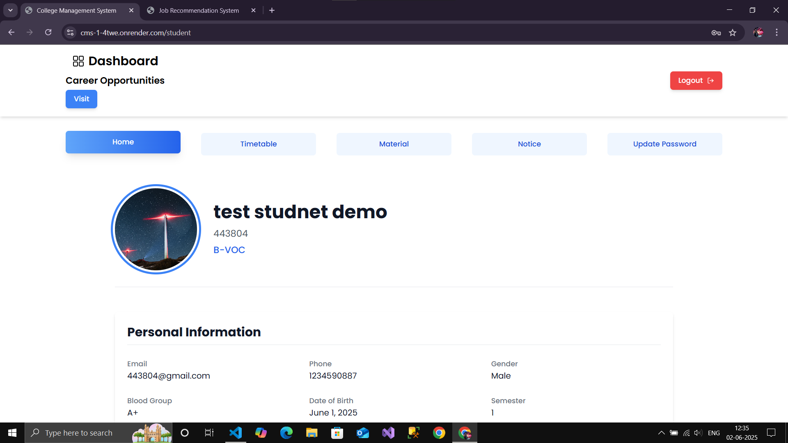
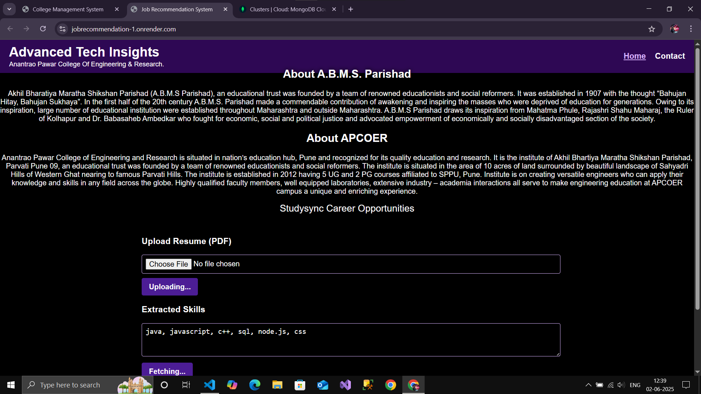
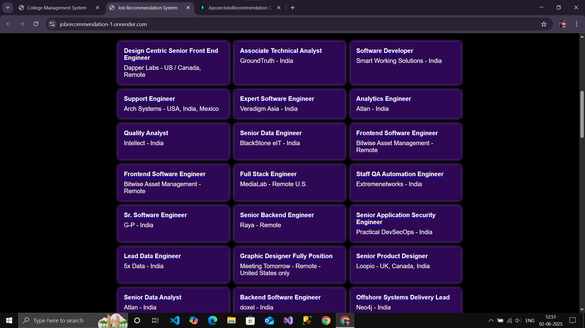
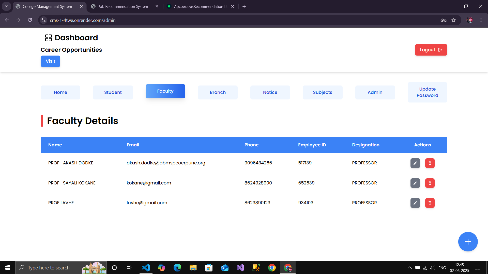
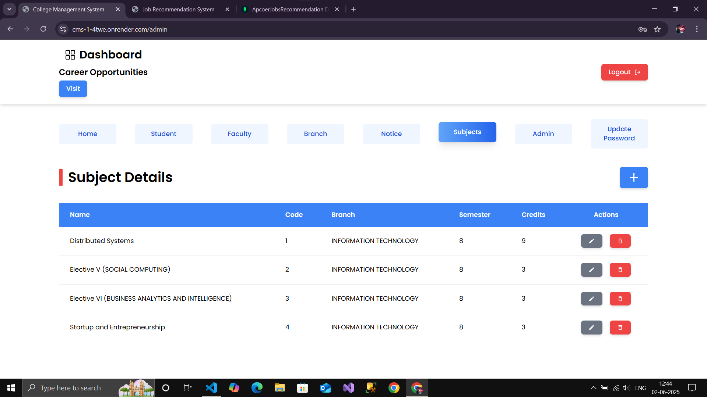

# College Management System with Job Recommendation



## Description

A comprehensive MERN stack application for managing college operations, including user management, academic resources, and administrative tasks. Additionally, it features a job recommendation system where users can upload their resume in PDF format. The system extracts skills from the resume, scrapes job listings from websites like Remotive and others, stores the data in MongoDB Atlas cloud database, and recommends jobs based on skill matching using TF-IDF algorithm.



## Features

### College Management Features
- User Authentication (Admin, Faculty, Student)
- Admin Dashboard: Manage admins, faculty, students, branches, subjects
- Faculty Dashboard: Manage marks, materials, timetables, view students
- Student Dashboard: View marks, materials, timetables, profile
- Notice Board
- File Uploads for materials and profiles

### Job Recommendation Features
- PDF Resume Upload
- Skill Extraction from Uploaded Resumes
- Job Scraping from Remotive and Other Job Websites
- Job Recommendations Based on TF-IDF Skill Matching
- User-Friendly Interface for Viewing Recommendations







## Tech Stack

- Backend: Flask, MongoDB Atlas, Scrapy (for web scraping), TF-IDF (for skill matching)
- Frontend: React, Redux, Tailwind CSS, Axios
- Deployment: Render

## Installation

### Prerequisites

- Python 3.x
- Node.js
- MongoDB Atlas account (for cloud database)

### Backend

1. Navigate to the backend directory:
   ```bash
   cd backend
   ```
2. Install Python dependencies:
   ```bash
   pip install -r requirements.txt
   ```
3. Create a `.env` file with the following variables:
   ```
   MONGO_URI=your_mongodb_atlas_connection_string
   SECRET_KEY=your_secret_key
   ```
4. Run the Flask application:
   ```bash
   flask run
   ```

### Frontend

1. Navigate to the frontend directory:
   ```bash
   cd frontend
   ```
2. Install dependencies:
   ```bash
   npm install
   ```
3. Start the frontend development server:
   ```bash
   npm start
   ```

## Usage

- Access the application at [http://localhost:3000](http://localhost:3000)
- **College Management:** Login with Admin, Faculty, or Student credentials to access respective dashboards for managing or viewing academic data.
- **Job Recommendation:** Upload your resume in PDF format. The system will extract skills, scrape job listings, and display recommended jobs based on skill matching.

## API Endpoints

### College Management APIs
- Authentication:
  - `/api/admin/auth`
  - `/api/faculty/auth`
  - `/api/student/auth`
- Details Management:
  - `/api/admin/details`
  - `/api/faculty/details`
  - `/api/student/details`
- Other Resources:
  - `/api/timetable`
  - `/api/material`
  - `/api/notice`
  - `/api/subject`
  - `/api/marks`
  - `/api/branch`

### Job Recommendation APIs
- `/upload` - Upload PDF resume and extract skills
- `/scrape` - Scrape job listings from websites
- `/recommend` - Get job recommendations based on skills
- `/jobs` - Retrieve stored job data

## Deployment

The application is deployed on Render. Access it at [your-render-url](https://your-render-url.onrender.com)

## Contributing

Contributions are welcome! Please fork the repository and submit a pull request for any enhancements or bug fixes.

## License

This project is licensed under the ISC License.

## Author

Ayan Sayyed
